# Краткое описание проекта

Это проект на игровом движке Unity, где при помощи Sentis интегрирована небольшая нейронная модель TinyStories в формате `.sentis` (также можно использовать формат `.onnx`) и реализовано взаимодействие с ней через UI-интерфейс.
Модель генерирует небольшой текст по промпту, написанному пользователем.

---

# Репозиторий

Краткое описание файлов репозитория:
- `merges.txt` — содержит правила, по которым символы объединяются в токены
- `tinystories.sentis` — нейронная модель в формате Sentis
- `vocab.json` — файл в формате JSON, который содержит сопоставление токенов и их уникальных идентификаторов (ID)
- Папка `Build` — билд проекта для Windows
- Папка `Scripts` — содержит скрипт `RunTinyStories.cs`, реализующий взаимодействие с нейронной сетью
- Папка `Image` — содержит изображения для документации

---

# Инструкция по использованию

1. Скачайте папку `Build`
2. Запустите проект через `.exe`-файл
3. В поле введите промпт для генерации на английском языке (например The dragon flew over the village)
4. Нажмите на рядом расположенную кнопку
5. Через несколько секунд появится текст, который сгенерировала языковая модель

---

# Шаги реализации проекта

## Импорт пакета Sentis

Для интеграции языковой модели в Unity используется **Unity Sentis** — инструмент, позволяющий запускать нейросети прямо в движке без внешних серверов.

**Установка:**
1.  создайте новый проект Unity или откройте существующий
2.	чтобы открыть менеджер пакетов, перейдите в "Окно" > "Менеджер пакетов"
3.	нажмите "+" и выберите "Добавить пакет по имени"...
4.	введите Com.unity.sentis
5.	при необхзодимости в поле ниже введите точную версию пакета
6.	нажмите "Добавить", чтобы добавить пакет в свой проект

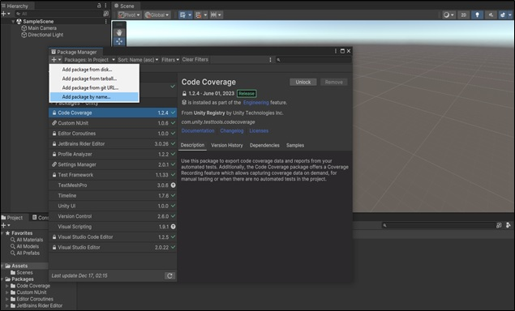

---

## Импорт модели и обязательных файлов

1. Скачайте модель `tinystories.sentis` (или `.onnx`), `merges.txt` и `vocab.json` (например, с [HuggingFace](https://huggingface.co))
2. Поместите файлы в папку `Assets/StreamingAssets`
3. Создайте папку `Scripts` для скриптов

---

## Создание скрипта для взаимодействия с нейронной сетью

Скрипт `RunTinyStories.cs` реализует UI-интерфейс:
- `InputField` — для ввода промпта
- `Text` — для вывода сгенерированного текста
- `Button` — для запуска генерации

### Основные методы:
Взаимодействие с моделью должно быть реализовано через UI интерфейс с `InputField` куда пользователь будет записывать свой промпт, `Text` в котором будет записываться сгенерированный текст модели и `Button` - кнопка, 
при нажатии на которую промпт будет отправляться модели для генерации. 
Так же учтём, что при повторном нажатии на кнопки, должна начаться новая генерация по новому промпту, записанном в `InputField`. 
Создадим скрипт `RunTinyStories.cs` в папке `Scripts`. Первым делом подключим необходимые библиотеки:
- `using System.Collections.Generic;` - библиотека для работы с коллекциями (списки, словари и т. д.)
- `using UnityEngine;` - основная библиотека Unity для работы с игровыми объектами, компонентами, физикой и т. д.
- `using Unity.Sentis;` - библиотека для запуска предобученных нейросетей (ONNX-моделей) прямо в Unity
- `using System.IO;` - библиотека для чтение/запись файлов (например, merges.txt, vocab.json или весов модели)
- `using System.Text;` - библиотека для работы с кодировками и текстом (например, UTF-8 для BPE-токенизации)
- `using FF = Unity.Sentis.Functional;` - упрощённый API для операций с тензорами в Sentis (аналог функционала из PyTorch)
- `using TMPro;` - библиотека для продвинутого отображения текста в Unity (поддержка Unicode, шрифты)
- `using UnityEngine.UI;` - библиотека для работы с UI-элементами (кнопки, слайдеры, Canvas) 
Далее объявляем необходимые поля 
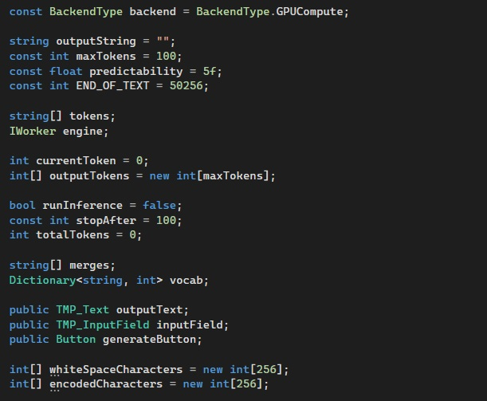
 Теперь напишем все необходимые методы для работы скрипта: 
`InitializeModel`:
- Освобождает предыдущую модель (engine.Dispose())
- Загружает ONNX-модель (tinystories.sentis)
- Компилирует её с помощью Functional (FF) для работы с токенами
- Создаёт "движок" для инференса через WorkerFactory 
`OnGenerateButtonClicked`:
- Сбрасывает состояние генерации (ResetGenerationState)
- Инициализирует модель (InitializeModel)
- Начинает генерацию с текста из inputField 
`RunInference`:
- Передаёт текущие токены в модель (engine.Execute)
- Получает предсказание следующего токена (Multinomial)
- Обновляет выходной текст, проверяя на END_OF_TEXT или лимит токенов 
`DecodePrompt`:
- Конвертирует текст в токены (GetTokens)
- Заполняет буфер outputTokens начальными токенами 
`LoadVocabulary`:
- Загружает `vocab.json` (словарь токенов) и `merges.txt` (BPE-правила)
- Создает обратный словарь tokens для декодирования 
`GetUnicodeText/GetASCIIText`:
- Конвертирует текст между UTF-8 и ASCII-подобной кодировкой (для обработки спецсимволов) 
`ShiftCharacterDown/ShiftCharacterUp`:
- Заменяет спецсимволы (например, пробелы) на числа >256 и обратно 
`SetupWhiteSpaceShifts/IsWhiteSpace`:
- Настраивает таблицы замены для пробельных символов 
`GetTokens/ApplyMerges`:
- Разбивает текст на токены с помощью BPE (правила из `merges.txt`)
- Конвертирует токены в ID через `vocab.json` 
`ResetGenerationState`:
- Сбрасывает буферы (outputTokens, outputString), счётчики и освобождает модель 
`OnDestroy`:
- Освобождает ресурсы модели при закрытии сцены 
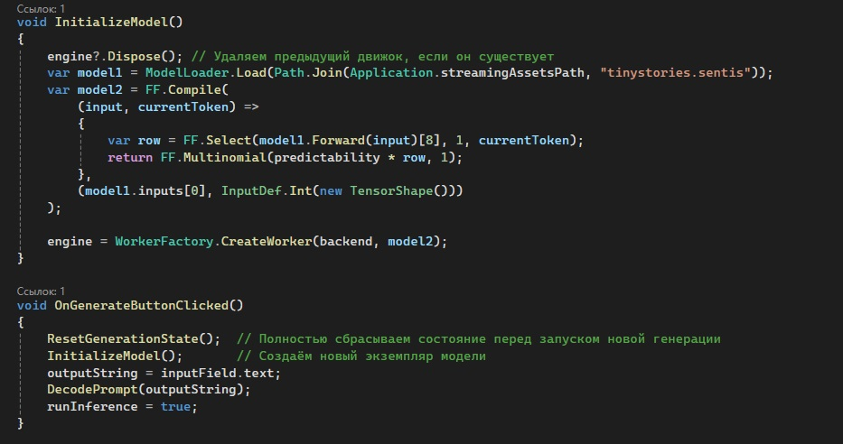
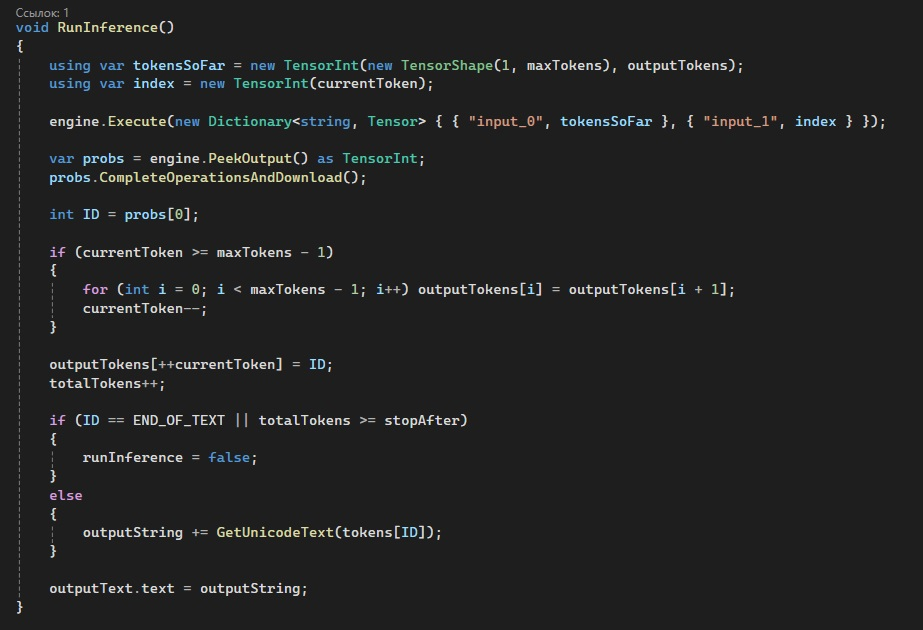
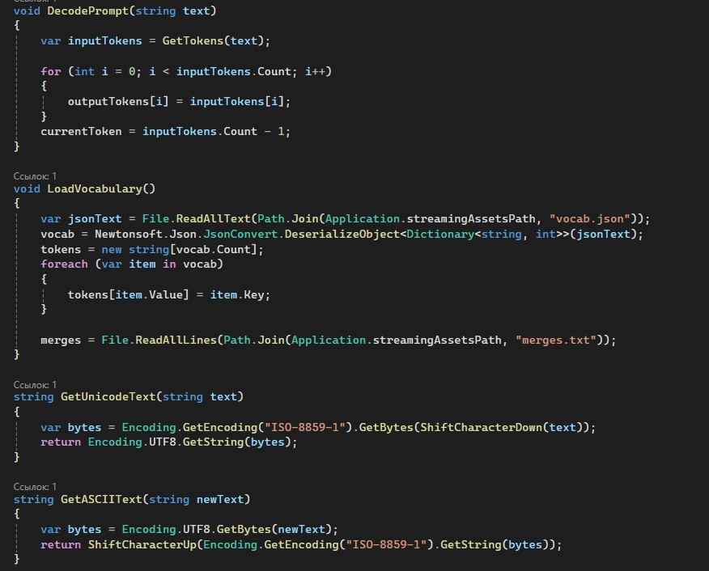
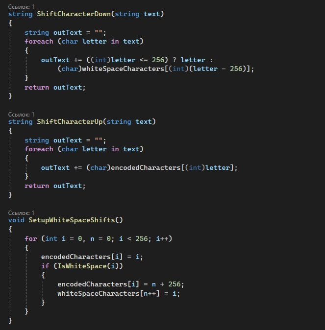
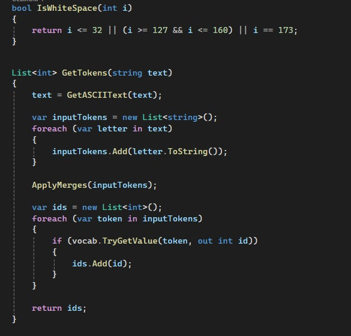
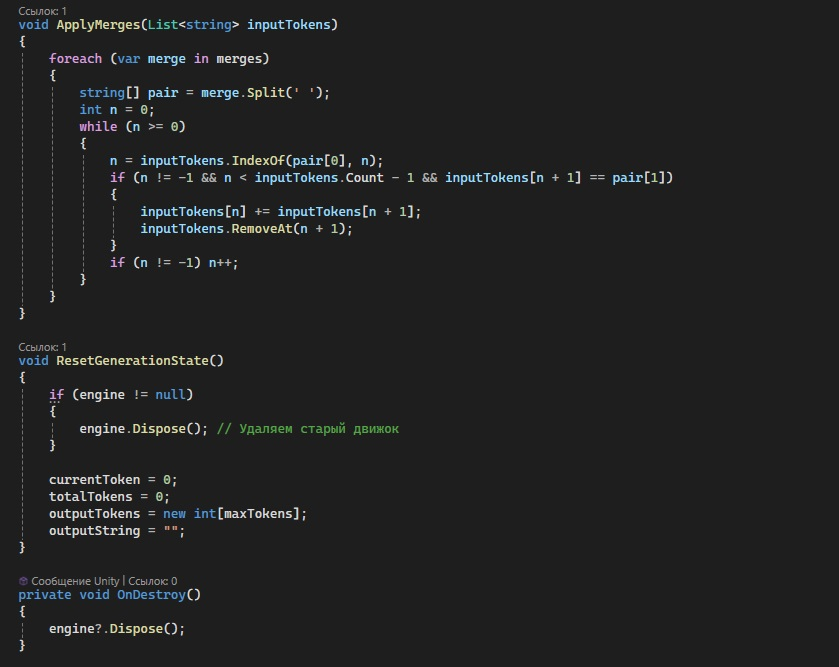
 Вызываем методы в стандартных методах Unity (`Start` и `Update`) 
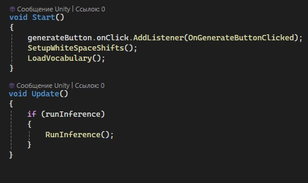
 С полным скриптом можно ознакомиться в папке `Scripts` этого репозитория (файл `RunTinyStories.cs`)

## Проверка работы

1. Сохраните скрипт `RunTinyStories.cs` и перетащите его на `Main Camera` (или любой другой объект на сцене).
2. Создайте `Canvas` и добавьте следующие UI-объекты:
   - `Button (TMP)`
   - `InputField (TMP)`
   - `Text (TMP)`

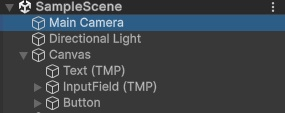

3. Настройте элементы по своему усмотрению (размеры, шрифт, расположение и т.д.)
4. Перетащите объекты через инспектор в соответствующие поля скрипта:
   - `Output Text` → Text (TMP)
   - `Input Field` → InputField (TMP)
   - `Generate Button` → Button (TMP)

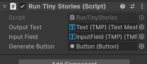

5. Запустите сцену и проверьте работу:
   - Введите текст в поле ввода
   - Нажмите кнопку генерации
   - Убедитесь, что модель корректно выводит текст

## Билд проекта

Для создания билда выполните следующие шаги:

1. Перейдите в `File > Build Settings...`
2. В открывшемся окне:
   - Выберите платформу (Windows)
   - Добавьте текущую сцену в билд
   - Настройте параметры качества (Quality Settings)
3. Нажмите `Build` и выберите папку для сохранения (рекомендуется использовать папку `Build` в проекте)
4. Дождитесь завершения процесса

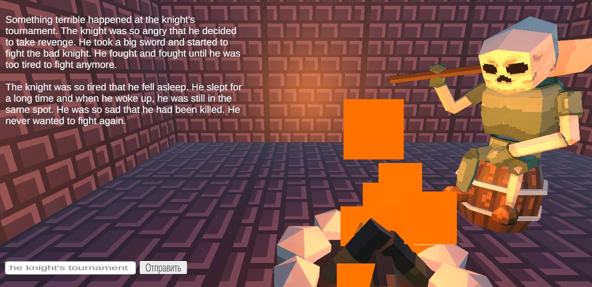

## Итоги

Был успешно реализован проект, интегрирующий языковую модель в Unity с использованием Sentis. Основные результаты:

- Локальное выполнение нейросетевой модели в игровом движке
- Простой UI-интерфейс для взаимодействия с моделью
- Рабочий билд для Windows

Возможные применения:
- Генерация диалогов NPC
- Создание динамических квестов и заданий
- Прототипирование AI-функционала в играх

Текущие ограничения:
- Производительность зависит от размера модели
- Необходима оптимизация для больших моделей
- Контроль качества сгенерированного текста

Перспективы развития:
- Интеграция более сложных моделей
- Добавление тонкой настройки (fine-tuning)
- Оптимизация через квантование
